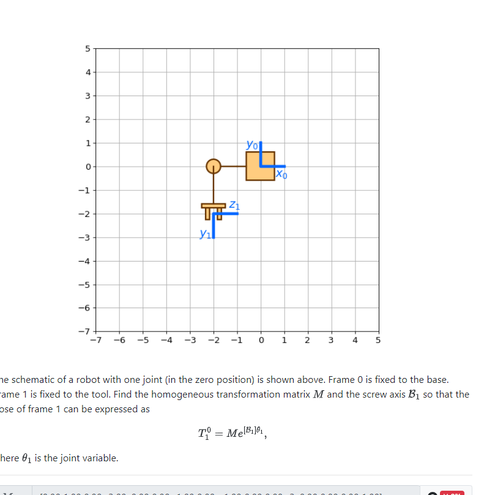
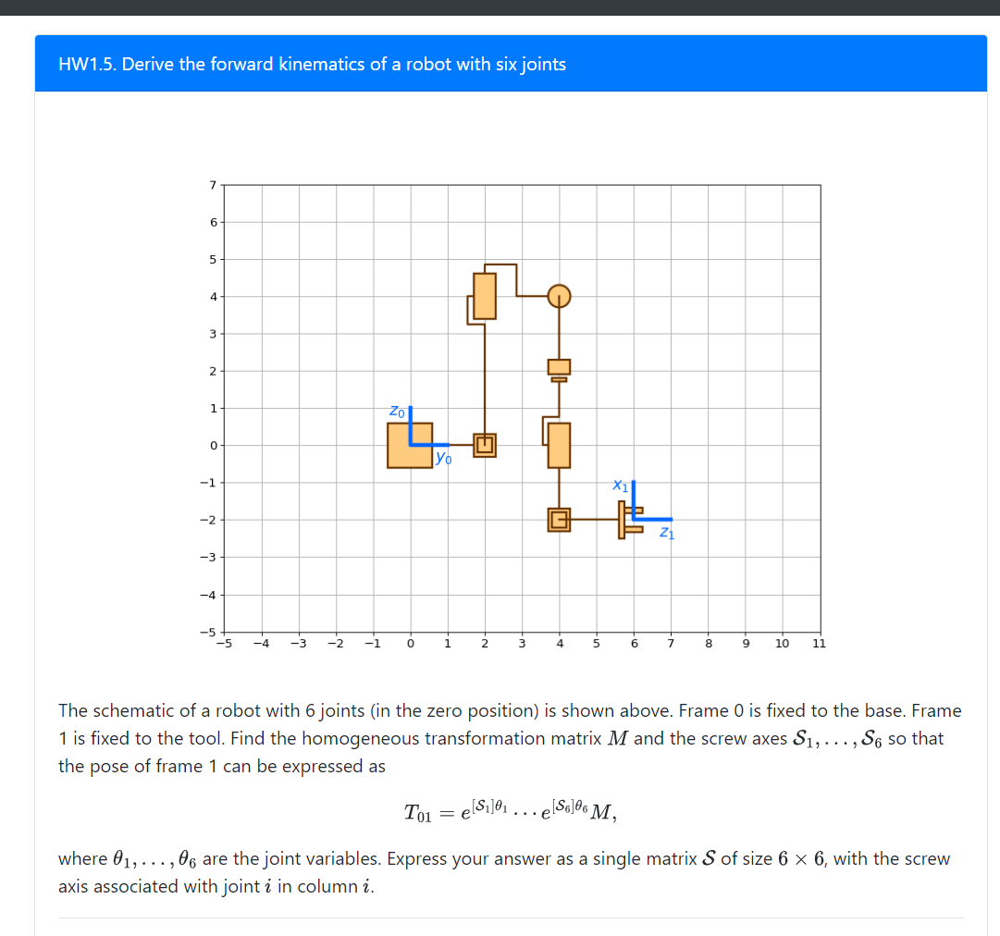

HW1.3

[0.00 1.00 0.00 -2.00; 0.00 0.00 -1.00 0.00; -1.00 0.00 0.00 -4.00; 0.00 0.00 0.00 1.00]

B = [0.00; 0.00; 1.00; 0.00; 2.00; 0.00]

[0 0 1 -2; 0 -1 0 -2; 1 0 0 0; 0 0 0 1]

M = [0 0 1 0; 0 1 0 2; -1 0 0 -2; 0 0 0 1]

B = [0; 1; 0; 0; 0; -2]

[0 1 0 0; 0 0 1 6; 1 0 0 -2; 0 0 0 1]

[0 0 1 0 0 0; 0 0 0 0 0 0; 0 1 0 0 -1 0; 1 2 0 0 -4 1; 0 0 4 0 0 0; 0 0 -4 -1 0 0]

HW1.5. Derive the forward kinematics of a robot with six joints

The schematic of a robot with 6 joints (in the zero position) is shown above. Frame 0 is fixed to the base. Frame 1 is fixed to the tool. Find the homogeneous transformation matrix$ M$ and the screw axes$ S_1, ..., S_6$ so that the pose of frame 1 can be expressed as

$$ T_{01} = e^{[S_1]\theta_1}...e^{[S_6]\theta_6}M, $$

where$ \theta_1, ..., \theta_6$ are the joint variables. Express your answer as a single matrix$ S$ of size 6 x 6, with the screw axis associated with joint$ i$ in column$ i$.

Frame 0 is at (0,0, 0), Frame 1 is at (6, 2, 0)

Find M and S matrix step by step. Use python to assist your analysis

The schematic of a robot with one joint (in the zero position) is shown above. Frame 0 is fixed to the base. Frame 1 is fixed to the tool. Find the homogeneous transformation matrix 
 and the screw axis 
 so that the pose of frame 1 can be expressed as
where 
 is the joint variable.