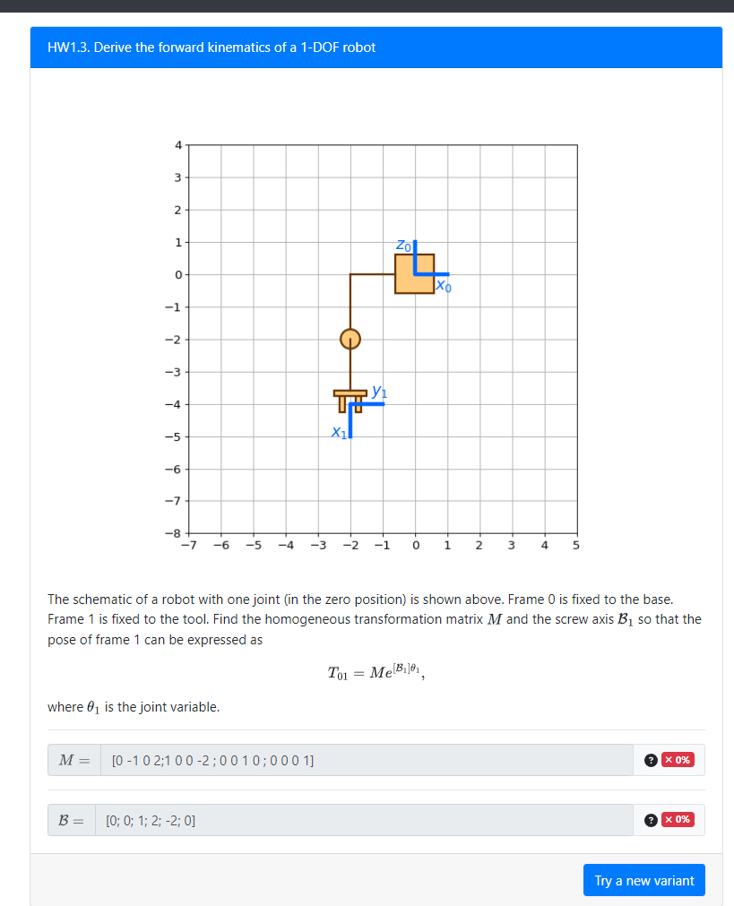
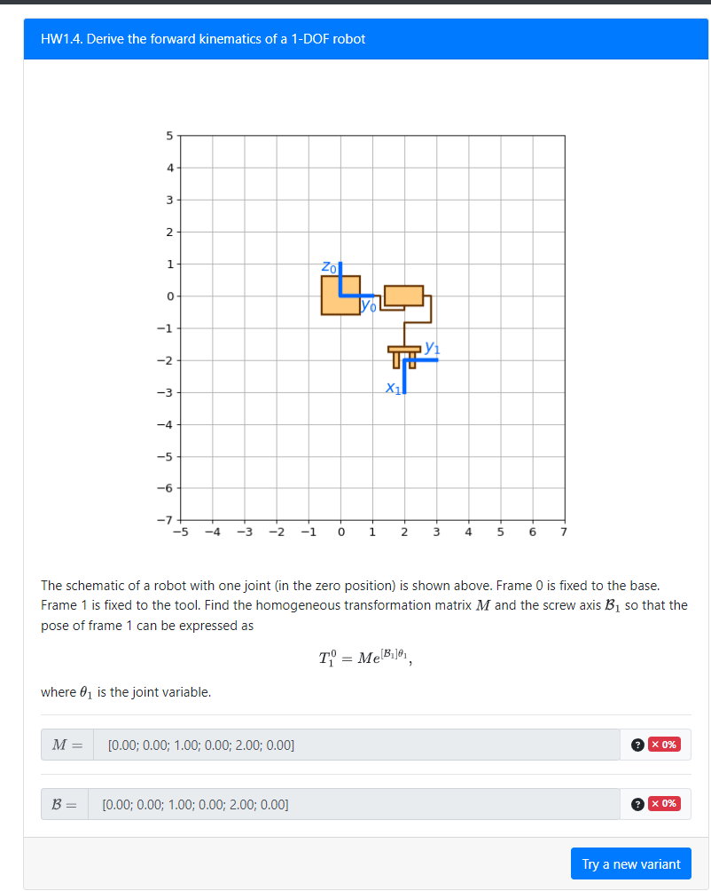

HW1.3

[0.00 1.00 0.00 -2.00; 0.00 0.00 -1.00 0.00; -1.00 0.00 0.00 -4.00; 0.00 0.00 0.00 1.00]

B = [0.00; 0.00; 1.00; 0.00; 2.00; 0.00]

M = [0 0 1 0; 0 1 0 2; -1 0 0 -2; 0 0 0 1]

B = [0; 1; 0; 0; 0; -2]