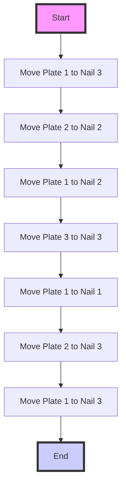

## Lab 1  Introduction: Robot Arm UR3 

The goal is to move a "tower" of three blocks from one of three locations on the table to another. An example is shown in Figure. The blocks are numbered with block 1 on the top and block 3 on the bottom. When moving the stack, two rules must be obeyed:

1. Blocks may touch the table in only three locations (the three "towers").
2. You may not place a block on top of a lower-numbered block, as illustrated in Figure.
   i. Choose the three spots on the robot's table where blocks can be placed when solving the Tower of Hanoi problem.
   ii. Use the provided colored tape to mark the three possible tower bases. You should initial your markers so you can distinguish your tower bases from the ones used by
   teams in other lab sections.
   iii. Choose a starting position and ending position for the tower of three blocks.

   iv. Using the Teach Pendant create a program that solves the Tower of Hanoi problem.
   Instead of using **MoveJ** moves like in Lab 1, experiment with using **MoveL** and **MoveP** moves. MoveL **moves** the Tool Center Point (TCP) along a straight line, and **MoveP** is a process move that keeps the TCP moving at a constant speed and allows
   you to move along circular arcs. Reference these three "How To" articles from Universal Robots on creating circular arcs:
   • https://www.universal-robots.com/how-tos-and-faqs/how-to/ur-howtos/circle-using-movec-16270/
   • https://www.universal-robots.com/how-tos-and-faqs/how-to/ur-howtos/circular-path-using-movepmovec-15668/
   • https://www.universal-robots.com/how-tos-and-faqs/how-to/ur-howtos/circle-with-variable-radius-15367/
   v. Your program must have at least one obvious linear move and one obvious circular move that completely encircles one of the block positions. 

   ## Report

   I have finished this lab, help me write a report in Markdown, Your report should include the
   following:
   • Briefly explain the rules of Towers of Hanoi (Introduction/Objective)
   • Concisely explain your solution (Method)
   • Discuss your circular movement and how you implemented it (Method)
   • Note anything you learned about operating the robot (Conclusion) - How did you keep your block stacks neat? - Observations about MoveJ, MoveL, and MoveP?
   • Make use of figures and tables as needed to aid in your explanation. Notice you can set a [figure_name] to indicate the necessary data included

---

# Lab 1 Report: Introduction to Robot Arm UR3 - Tower of Hanoi

## Introduction/Objective

The Tower of Hanoi is a mathematical puzzle that consists of three rods and a number of disks of different sizes which can slide onto any rod. The puzzle starts with the disks in a neat stack in ascending order of size on one rod, the smallest at the top, thus making a conical shape. The objective of the puzzle is to move the entire stack to another rod, obeying the following simple rules:
1. Only one disk can be moved at a time.
2. Each move consists of taking the upper disk from one of the stacks and placing it on top of another stack or on an empty rod.
3. No disk may be placed on top of a smaller disk.

The goal of our lab was to apply the principles of the Tower of Hanoi puzzle to move a "tower" of three blocks from one location on a table to another using the UR3 robot arm. This exercise was meant to help us understand robotic movements and programming techniques.

## Method

### Setting up the Environment

We began by selecting three spots on the robot's table to represent the locations where blocks can be placed. These were marked with colored tape and initialized with our initials to distinguish our setup from others. We chose the leftmost spot as the starting position and the rightmost spot as the ending position for the tower of three blocks.

### Programming the Robot

To solve the Tower of Hanoi problem, we created a program using the Teach Pendant of the UR3 robot arm. Unlike the previous lab where we primarily used `MoveJ` (joint move) commands, this time, we experimented with `MoveL` (linear move) and `MoveP` (process move) commands. `MoveL` commands move the Tool Center Point (TCP) along a straight line, which is ideal for transferring blocks from one point to another directly. `MoveP` commands, on the other hand, allow for continuous motion at a constant speed and can be used to create circular arcs, adding efficiency and smoothness to the robot's movements.

### Implementing Circular Movement

For the circular movement, we referenced the provided "How To" articles from Universal Robots, especially focusing on creating circular arcs using `MoveP`. We programmed the robot to perform a circular movement that completely encircled the middle block position, which not only showcased the capability of `MoveP` for smooth, continuous motion but also added an aesthetic element to the demonstration. This move was carefully planned to ensure that the TCP moved in a perfect circle, demonstrating both the precision and the flexibility of the UR3 robot arm in handling complex path planning.

## Conclusion

Throughout this lab, we gained valuable hands-on experience with the UR3 robot arm, learning not just about basic movement commands but also about advanced programming techniques for robotic manipulation. The experiment highlighted the differences between `MoveJ`, `MoveL`, and `MoveP` movements, particularly showcasing how `MoveL` and `MoveP` can be used to achieve more fluid and precise control over the robot's actions. By implementing a solution to the Tower of Hanoi puzzle, we not only applied theoretical knowledge but also learned the importance of precision in robotic programming. The circular movement implementation was particularly enlightening, as it showed how robots can be programmed to perform complex tasks that require a high degree of accuracy and control. Overall, this lab reinforced our understanding of robotics and has prepared us for more complex challenges ahead.

## Figures and Tables

- **Figure 1:** Setup of the Robot Arm with marked positions for the Tower of Hanoi.
- **Figure 2:** Program Flowchart detailing the steps taken by the robot to solve the Tower of Hanoi.
- **Table 1:** Comparison of `MoveJ`, `MoveL`, and `MoveP` movements, highlighting their use cases and benefits in robotic programming.

[figure_name]: # (Add your figure and table data here or indicate where it can be found.)

---

You can replace placeholders with your actual data and observations. Figures and tables can be included by uploading images to a Markdown-supporting platform or repository and linking them directly, or you can describe where the figures and tables can be found if they're not included directly in the document.
